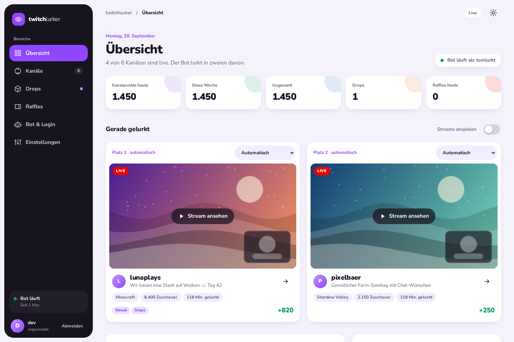
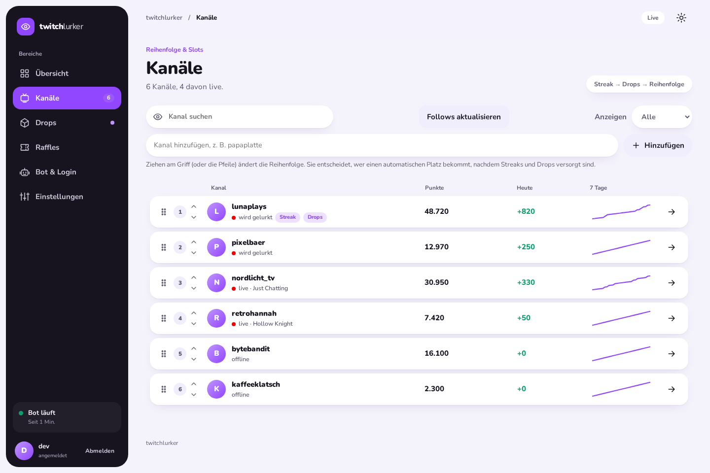
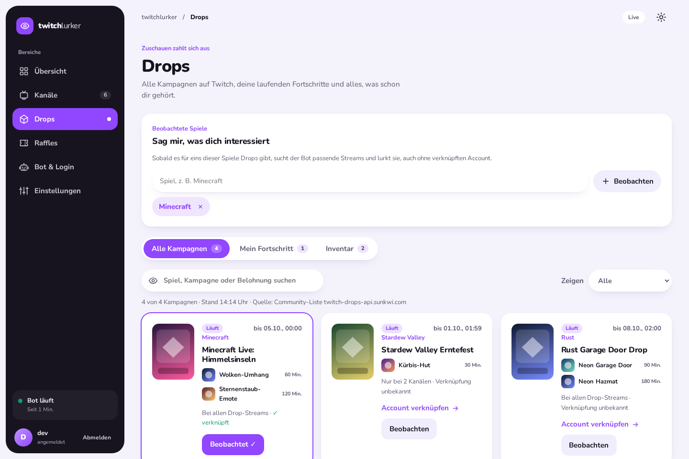
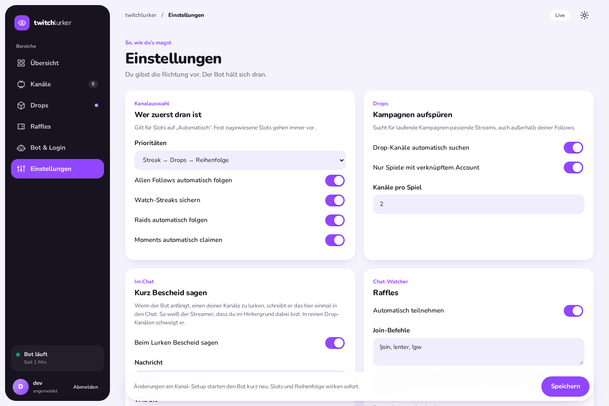
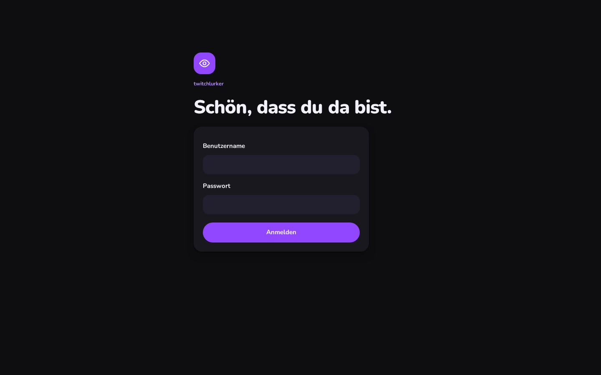
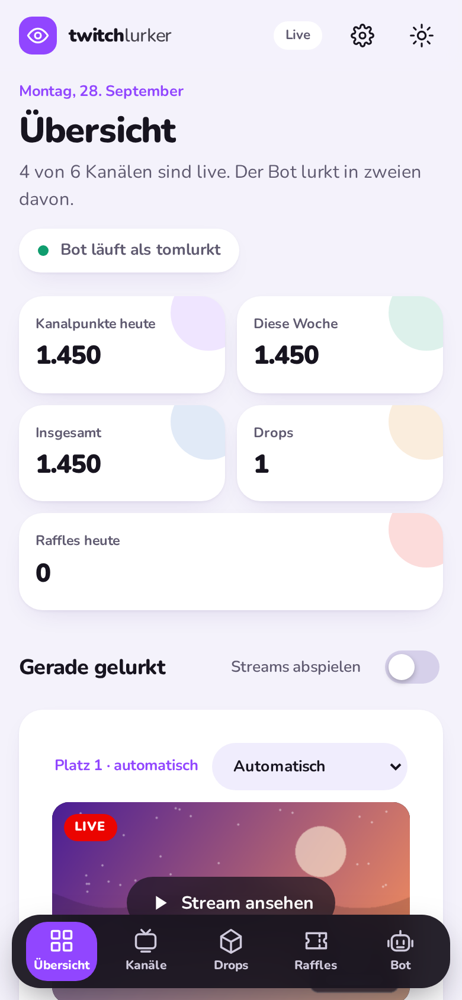
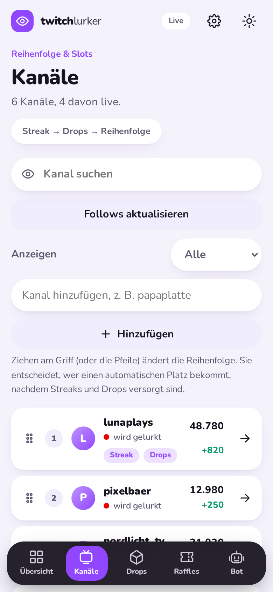
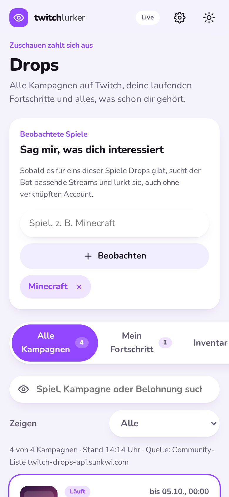
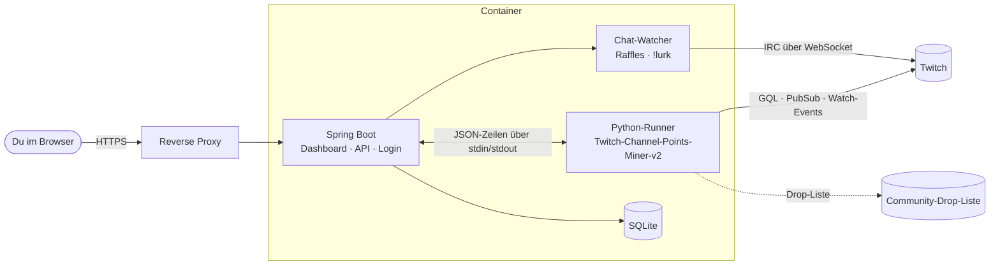

<div align="center">



<br>

[](https://github.com/Raindancer118/twitchlurker/actions/workflows/ci.yml)
[](https://github.com/Raindancer118/twitchlurker/tags)
[](https://github.com/Raindancer118/twitchlurker/pkgs/container/twitchlurker)


[](LICENSE)

**Dein Twitch-Account sammelt, während du lebst.**<br>
Kanalpunkte, Bonus-Truhen, Watch-Streaks, Raids, Moments, Drops und Chat-Verlosungen, rund um die Uhr,<br>
mit einem Dashboard, das man gern aufmacht. Selbst gehostet, auf deinem Server, mit deinem Login.

[Schnellstart](#-schnellstart) · [Funktionen](#-was-er-alles-kann) · [Screenshots](#-so-sieht-es-aus) · [Konfiguration](#%EF%B8%8F-konfiguration) · [Wie es funktioniert](#-wie-es-funktioniert)

<br>

<picture>
  <source media="(prefers-color-scheme: dark)" srcset="docs/screenshots/overview-dark.png">
  
</picture>

</div>

<br>

## ✨ Was er alles kann

<table>
<tr>
<td width="50%" valign="top">

### 📺 Lurken, das sich lohnt
- Lurkt **24/7** in deinen Follows, Twitch zählt immer zwei Kanäle gleichzeitig
- **Slots selbst belegen**: zwei Plätze, jeder „automatisch“ oder fest auf einen Kanal
- **Reihenfolge per Drag & Drop**, wirkt sofort, ohne Neustart
- Holt **Bonus-Truhen**, sichert **Watch-Streaks**, folgt **Raids**, claimt **Moments**
- Die zwei gelurkten Streams laufen als **echter Twitch-Player** im Dashboard
- Neue Follows kommen **automatisch** dazu

</td>
<td width="50%" valign="top">

### 🎁 Drops & Verlosungen
- **Alle aktiven Drop-Kampagnen**, durchsuchbar nach Spiel, Kampagne oder Belohnung
- **Spiele beobachten** (z. B. Minecraft): gibt es Drops, lurkt er passende Streams
- Fortschritt, Inventar, **automatisches Claimen**
- **Raffles im Chat**: erkennt Ansagen von StreamElements, Nightbot & Co. und tippt einmal den richtigen Befehl
- Sagt auf Wunsch einmal **`!lurk`**, damit Streamer wissen, dass du im Hintergrund dabei bist

</td>
</tr>
<tr>
<td valign="top">

### 🧁 Ein Dashboard zum Wohlfühlen
- Hell und dunkel, **richtig mobil** mit Tab-Leiste unten
- **Live-Updates** ohne Neuladen, Punkte zählen hoch
- Ruhige Animationen, die `prefers-reduced-motion` respektieren

</td>
<td valign="top">

### 🔒 Deins, nicht unseres
- **Selbst gehostet**, ein Container, SQLite, keine Cloud
- Login per **Passwort** oder beliebigem **OIDC-Anbieter** (Authentik, Keycloak, Authelia, …)
- Twitch-Token bleibt auf dem Server, strenge CSP, Rate-Limits

</td>
</tr>
</table>

## 📸 So sieht es aus

<table>
<tr>
<td width="50%"><picture><source media="(prefers-color-scheme: dark)" srcset="docs/screenshots/channels-dark.png"></picture><p align="center"><b>Kanäle</b>: ziehen, sortieren, Verlauf im Blick</p></td>
<td width="50%"><picture><source media="(prefers-color-scheme: dark)" srcset="docs/screenshots/drops-dark.png"></picture><p align="center"><b>Drops</b>: alle Kampagnen, beobachtete Spiele</p></td>
</tr>
<tr>
<td width="50%"><picture><source media="(prefers-color-scheme: dark)" srcset="docs/screenshots/settings-dark.png"></picture><p align="center"><b>Einstellungen</b>: Prioritäten, Raffles, <code>!lurk</code></p></td>
<td width="50%"><p align="center"><b>Login</b>: Passwort oder OIDC</p></td>
</tr>
</table>

<div align="center">
<picture><source media="(prefers-color-scheme: dark)" srcset="docs/screenshots/mobile-overview-dark.png"></picture>
&nbsp;
<picture><source media="(prefers-color-scheme: dark)" srcset="docs/screenshots/mobile-channels-dark.png"></picture>
&nbsp;
<picture><source media="(prefers-color-scheme: dark)" srcset="docs/screenshots/mobile-drops-dark.png"></picture>
<p><sub>Alle Kanäle, Titel und Bilder in den Screenshots sind erfunden.</sub></p>
</div>

## 🚀 Schnellstart

Du brauchst einen Rechner mit Docker, der durchläuft (VPS, Raspberry Pi, NAS …). Das Image gibt es für **amd64 und arm64**.

```bash
mkdir twitchlurker && cd twitchlurker
curl -O https://raw.githubusercontent.com/Raindancer118/twitchlurker/main/compose.yml
curl -o .env https://raw.githubusercontent.com/Raindancer118/twitchlurker/main/.env.example

# Passwort setzen (mindestens 12 Zeichen)
sed -i "s/^LURKER_PASSWORD=.*/LURKER_PASSWORD=$(openssl rand -base64 18)/" .env
grep LURKER_PASSWORD .env

docker compose pull && docker compose up -d
```

Dann:

1. Das Dashboard läuft auf `http://127.0.0.1:8080`. Mach es über einen Reverse Proxy mit HTTPS erreichbar ([siehe unten](#-hinter-einem-reverse-proxy)), oder teste lokal mit `COOKIE_SECURE=false`.
2. Mit `admin` und dem Passwort aus `.env` anmelden.
3. Unter **Bot & Login → Mit Twitch verbinden** bekommst du einen Code, den du auf [twitch.tv/activate](https://www.twitch.tv/activate) eingibst. Fertig, der Bot legt los.

> [!TIP]
> Updates: `docker compose pull && docker compose up -d`. Deine Daten (Verlauf, Einstellungen, Twitch-Token) liegen im Volume `lurker-data` und bleiben erhalten.

## ⚙️ Konfiguration

Alles läuft über die `.env` (Vorlage: [`.env.example`](.env.example)).

| Variable | Standard | Wofür |
|---|---|---|
| `LURKER_AUTH_MODE` | `password` | `password` (ein Konto) oder `oidc` (beliebiger OpenID-Connect-Anbieter) |
| `LURKER_USERNAME` / `LURKER_PASSWORD` | `admin` / – | Login im Passwort-Modus, Passwort mind. 12 Zeichen |
| `OIDC_ISSUER_URI` | – | Issuer deines Anbieters, Endpunkte werden beim ersten Login ermittelt |
| `OIDC_CLIENT_ID` / `OIDC_CLIENT_SECRET` | – | Client beim Anbieter, Redirect-URI: `https://<deine-domain>/login/oauth2/code/oidc` |
| `OIDC_AUTHORIZATION_URI`, `OIDC_TOKEN_URI`, `OIDC_USERINFO_URI`, `OIDC_JWKS_URI` | – | optional statt Discovery, dann startet der Bot auch, wenn der Anbieter gerade weg ist |
| `LURKER_ALLOWED_EMAILS` / `LURKER_ALLOWED_GROUPS` | – | wer rein darf (OIDC). Leer heißt: niemand |
| `OIDC_GROUPS_CLAIM` | `groups` | Claim mit den Gruppennamen |
| `LURKER_PORT` / `LURKER_BIND` | `8080` / `127.0.0.1` | Port und Adresse auf dem Host |
| `TRUSTED_PROXIES` | Loopback + private Netze | Regex der Proxys, deren `X-Forwarded-*` gelten |
| `COOKIE_SECURE` | `true` | nur für HTTP-Tests ohne Proxy auf `false` |
| `LURKER_TIMEZONE` | `Europe/Berlin` | wann „heute“ anfängt |
| `LURKER_VERSION` | `latest` | Image-Version festnageln, z. B. `0.7.0` |

Alles andere (Prioritäten, Slots, Raffles, beobachtete Spiele, `!lurk`) stellst du bequem im Dashboard ein.

### 🔐 Login per OIDC

```dotenv
LURKER_AUTH_MODE=oidc
OIDC_ISSUER_URI=https://auth.example.org/application/o/twitchlurker/
OIDC_CLIENT_ID=…
OIDC_CLIENT_SECRET=…
LURKER_ALLOWED_GROUPS=twitchlurker
```

Beim Anbieter eine Web-Anwendung (Authorization Code) anlegen, Redirect-URI `https://<deine-domain>/login/oauth2/code/oidc`, Scopes `openid profile email`. Gruppen kommen aus dem `groups`-Claim, E-Mails zählen nur mit `email_verified`.

### 🌐 Hinter einem Reverse Proxy

Der Live-Stream des Dashboards (Server-Sent Events unter `/api/live`) darf nicht gepuffert werden. Für nginx:

```nginx
location / {
    proxy_pass http://127.0.0.1:8080;
    proxy_set_header Host $host;
    proxy_set_header X-Forwarded-For $proxy_add_x_forwarded_for;
    proxy_set_header X-Forwarded-Proto $scheme;
}
location /api/live {
    proxy_pass http://127.0.0.1:8080;
    proxy_set_header Host $host;
    proxy_set_header X-Forwarded-For $proxy_add_x_forwarded_for;
    proxy_set_header X-Forwarded-Proto $scheme;
    proxy_http_version 1.1;
    proxy_set_header Connection "";
    proxy_buffering off;
    proxy_read_timeout 1h;
}
```

Läuft der Proxy auf einem anderen Rechner und kommt über eine öffentliche IP, trag sie in `TRUSTED_PROXIES` ein, sonst stimmen die Redirect-URIs nicht.

## 🧠 Wie es funktioniert



- **Java/Spring Boot** hält Dashboard, API, Login, Verlauf (SQLite) und den Chat-Watcher. Der **Python-Runner** ist [Twitch-Channel-Points-Miner-v2](https://github.com/rdavydov/Twitch-Channel-Points-Miner-v2) mit ein paar Haken: feste Slots, Reihenfolge und Drop-Suche wirken live.
- Ein **einziger Twitch-Token** (Device-Login, Scopes inkl. `chat:edit`) reicht für Punkte, Drops und Chat.
- Twitch zeigt die Liste aller Drop-Kampagnen nur noch integritätsgeschützten Clients. Der Katalog kommt deshalb aus der öffentlichen Community-Liste [twitch-drops-api.sunkwi.com](https://twitch-drops-api.sunkwi.com/drops) (änderbar per `LURKER_COMMUNITY_DROPS_URL`). Beobachtete Spiele sucht der Bot unabhängig davon direkt im Twitch-Verzeichnis nach Streams mit aktivierten Drops.

## 🛠️ Entwicklung

```bash
./mvnw verify                                         # Java-Tests inkl. Startup-Test
pip install -r runner/requirements.txt pytest pyflakes  # siehe Dockerfile für das Miner-Paket
python -m pyflakes runner/*.py && python -m pytest runner/tests
cd e2e && npm ci && npx playwright install chromium && npx playwright test   # E2E gegen das echte Jar mit Fake-Miner
```

Screenshots für dieses README neu erzeugen (erfundene Daten, generierte Bilder):
`cd e2e && TL_SHOWCASE=1 TL_FAKE_RUNNER=showcase_miner.py npx playwright test readme-shots`

**Eigene Instanz mit Auto-Deploy:** Die CI testet jeden Push. Deployen tut sie nur, wenn im Repo die Variable `DEPLOY_ENABLED=true` und die Secrets `DEPLOY_HOST`, `DEPLOY_USER`, `DEPLOY_SSH_KEY`, `DEPLOY_KNOWN_HOSTS` gesetzt sind (optional `DEPLOY_HEALTH_URL`). Dann baut sie per SSH auf dem Server, testet den Runner im neuen Image und schaltet erst danach um. Releases (`git tag X.Y.Z && git push origin X.Y.Z`) veröffentlichen das Multi-Arch-Image auf GHCR.

## ⚠️ Gut zu wissen

- Automatisiertes Zuschauen verstößt vermutlich gegen die Nutzungsbedingungen von Twitch. Du nutzt das auf eigenes Risiko für deinen eigenen Account. Kein offizielles Twitch-Projekt.
- Twitch zählt Kanalpunkte und Drops für höchstens **zwei Kanäle gleichzeitig**.
- Für Raffles braucht der Token `chat:edit`. Fehlt es, sagt dir das Dashboard, dass du Twitch einmal neu verbinden sollst.
- Viele Raffles verlangen, dass du dem Kanal folgst oder ein Abo hast. Die Ablehnung von Twitch landet im Raffle-Log.

## 💜 Dank & Lizenz

Gebaut auf [Twitch-Channel-Points-Miner-v2](https://github.com/rdavydov/Twitch-Channel-Points-Miner-v2) (GPL-3.0), mit GQL-Wissen aus dem [TwitchDropsMiner](https://github.com/DevilXD/TwitchDropsMiner) und der Drop-Liste von [twitch-drops-api.sunkwi.com](https://twitch-drops-api.sunkwi.com).

[**Rain's Do Whatever The Fuck You Want With It License**](LICENSE): mach damit, was du willst. `runner/lurker_watch.py` enthält Code aus TCPM und bleibt GPL-3.0-or-later.
