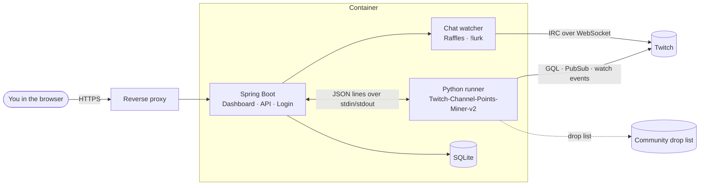

<div align="center">


<br>

[](https://github.com/Raindancer118/twitchlurker/actions/workflows/ci.yml)
[](https://github.com/Raindancer118/twitchlurker/tags)
[](https://github.com/Raindancer118/twitchlurker/pkgs/container/twitchlurker)


[](LICENSE)

**Your Twitch account collects while you live your life.**<br>
Channel points, bonus chests, watch streaks, raids, moments, drops and chat raffles, around the clock,<br>
with a dashboard you actually enjoy opening. Self-hosted, on your server, behind your login.

[Quick start](#-quick-start) · [Features](#-what-it-does) · [Screenshots](#-what-it-looks-like) · [Configuration](#%EF%B8%8F-configuration) · [How it works](#-how-it-works)

<br>

<picture>
  <source media="(prefers-color-scheme: dark)" srcset="docs/screenshots/overview-dark.png">
  
</picture>

</div>

<br>

## ✨ What it does

<table>
<tr>
<td width="50%" valign="top">

### 📺 Lurking that pays off
- Lurks your follows **24/7**; Twitch counts two channels at a time
- **Assign the slots yourself**: two seats, each "automatic" or pinned to a channel
- **Drag & drop the order**, applied instantly, no restart
- Grabs **bonus chests**, keeps **watch streaks**, follows **raids**, claims **moments**
- The two lurked streams play as a **real Twitch player** right in the dashboard
- New follows are picked up **automatically**

</td>
<td width="50%" valign="top">

### 🎁 Drops & raffles
- **Every active drop campaign**, searchable by game, campaign or reward
- **Watch games** (e.g. Minecraft): as soon as there are drops, it lurks matching streams
- Progress, inventory, **automatic claiming**
- **Chat raffles**: spots announcements from StreamElements, Nightbot & co. and types the right command once
- Optionally says **`!lurk`** once, so streamers know you're around in the background

</td>
</tr>
<tr>
<td valign="top">

### 🧁 A dashboard that feels nice
- Light and dark, **properly mobile** with a bottom tab bar
- **Live updates** without reloading, points count up
- Calm animations that respect `prefers-reduced-motion`

</td>
<td valign="top">

### 🔒 Yours, not ours
- **Self-hosted**: one container, SQLite, no cloud
- Log in with a **password** or any **OIDC provider** (Authentik, Keycloak, Authelia, …)
- The Twitch token stays on your server, strict CSP, rate limits

</td>
</tr>
</table>

## 📸 What it looks like

<table>
<tr>
<td width="50%"><picture><source media="(prefers-color-scheme: dark)" srcset="docs/screenshots/channels-dark.png"></picture><p align="center"><b>Channels</b>: drag, sort, keep an eye on the history</p></td>
<td width="50%"><picture><source media="(prefers-color-scheme: dark)" srcset="docs/screenshots/drops-dark.png"></picture><p align="center"><b>Drops</b>: every campaign, watched games</p></td>
</tr>
<tr>
<td width="50%"><picture><source media="(prefers-color-scheme: dark)" srcset="docs/screenshots/settings-dark.png"></picture><p align="center"><b>Settings</b>: priorities, raffles, <code>!lurk</code></p></td>
<td width="50%"><p align="center"><b>Login</b>: password or OIDC</p></td>
</tr>
</table>

<div align="center">
<picture><source media="(prefers-color-scheme: dark)" srcset="docs/screenshots/mobile-overview-dark.png"></picture>
&nbsp;
<picture><source media="(prefers-color-scheme: dark)" srcset="docs/screenshots/mobile-channels-dark.png"></picture>
&nbsp;
<picture><source media="(prefers-color-scheme: dark)" srcset="docs/screenshots/mobile-drops-dark.png"></picture>
<p><sub>All channels, titles and images in the screenshots are made up.</sub></p>
</div>

## 🚀 Quick start

You need a machine with Docker that stays on (VPS, Raspberry Pi, NAS …). The image is available for **amd64 and arm64**.

```bash
mkdir twitchlurker && cd twitchlurker
curl -O https://raw.githubusercontent.com/Raindancer118/twitchlurker/main/compose.yml
curl -o .env https://raw.githubusercontent.com/Raindancer118/twitchlurker/main/.env.example

# set a password (at least 12 characters)
sed -i "s/^LURKER_PASSWORD=.*/LURKER_PASSWORD=$(openssl rand -base64 18)/" .env
grep LURKER_PASSWORD .env

docker compose pull && docker compose up -d
```

Then:

1. The dashboard runs on `http://127.0.0.1:8080`. Expose it through a reverse proxy with HTTPS ([see below](#-behind-a-reverse-proxy)), or try it locally with `COOKIE_SECURE=false`.
2. Log in with `admin` and the password from `.env`.
3. Under **Bot & Login → Connect Twitch** you get a code to enter at [twitch.tv/activate](https://www.twitch.tv/activate). Done, the bot gets going.

> [!TIP]
> Updates: `docker compose pull && docker compose up -d`. Your data (history, settings, Twitch token) lives in the `lurker-data` volume and survives updates.

## ⚙️ Configuration

Everything goes through `.env` (template: [`.env.example`](.env.example)).

| Variable | Default | What for |
|---|---|---|
| `LURKER_AUTH_MODE` | `password` | `password` (single account) or `oidc` (any OpenID Connect provider) |
| `LURKER_USERNAME` / `LURKER_PASSWORD` | `admin` / – | login in password mode, password at least 12 characters |
| `OIDC_ISSUER_URI` | – | your provider's issuer, endpoints are discovered on the first login |
| `OIDC_CLIENT_ID` / `OIDC_CLIENT_SECRET` | – | client at your provider, redirect URI: `https://<your-domain>/login/oauth2/code/oidc` |
| `OIDC_AUTHORIZATION_URI`, `OIDC_TOKEN_URI`, `OIDC_USERINFO_URI`, `OIDC_JWKS_URI` | – | optional instead of discovery, so the bot starts even while the provider is down |
| `LURKER_ALLOWED_EMAILS` / `LURKER_ALLOWED_GROUPS` | – | who may log in (OIDC). Empty means nobody |
| `OIDC_GROUPS_CLAIM` | `groups` | claim holding the group names |
| `LURKER_PORT` / `LURKER_BIND` | `8080` / `127.0.0.1` | port and address on the host |
| `TRUSTED_PROXIES` | loopback + private networks | regex of proxies whose `X-Forwarded-*` headers are trusted |
| `COOKIE_SECURE` | `true` | set to `false` only for plain-HTTP tests without a proxy |
| `LURKER_TIMEZONE` | `UTC` | when "today" starts, e.g. `Europe/Berlin` |
| `LURKER_VERSION` | `latest` | pin an image version, e.g. `0.8.0` |

Everything else (priorities, slots, raffles, watched games, `!lurk`) is set comfortably in the dashboard.

### 🔐 Login via OIDC

```dotenv
LURKER_AUTH_MODE=oidc
OIDC_ISSUER_URI=https://auth.example.org/application/o/twitchlurker/
OIDC_CLIENT_ID=…
OIDC_CLIENT_SECRET=…
LURKER_ALLOWED_GROUPS=twitchlurker
```

Create a web application (authorization code flow) at your provider with redirect URI `https://<your-domain>/login/oauth2/code/oidc` and scopes `openid profile email`. Groups come from the `groups` claim; e-mail addresses only count with `email_verified`.

### 🌐 Behind a reverse proxy

The dashboard's live stream (server-sent events at `/api/live`) must not be buffered. For nginx:

```nginx
location / {
    proxy_pass http://127.0.0.1:8080;
    proxy_set_header Host $host;
    proxy_set_header X-Forwarded-For $proxy_add_x_forwarded_for;
    proxy_set_header X-Forwarded-Proto $scheme;
}
location /api/live {
    proxy_pass http://127.0.0.1:8080;
    proxy_set_header Host $host;
    proxy_set_header X-Forwarded-For $proxy_add_x_forwarded_for;
    proxy_set_header X-Forwarded-Proto $scheme;
    proxy_http_version 1.1;
    proxy_set_header Connection "";
    proxy_buffering off;
    proxy_read_timeout 1h;
}
```

If the proxy runs on another machine and connects from a public IP, add it to `TRUSTED_PROXIES`, otherwise the redirect URIs come out wrong.

## 🧠 How it works



- **Java/Spring Boot** runs the dashboard, API, login, history (SQLite) and the chat watcher. The **Python runner** is [Twitch-Channel-Points-Miner-v2](https://github.com/rdavydov/Twitch-Channel-Points-Miner-v2) with a few hooks, so pinned slots, order and drop scouting apply live.
- A **single Twitch token** (device login, scopes incl. `chat:edit`) covers points, drops and chat.
- Twitch only shows the full list of drop campaigns to integrity-protected clients. The catalogue therefore comes from the public community list [twitch-drops-api.sunkwi.com](https://twitch-drops-api.sunkwi.com/drops) (configurable via `LURKER_COMMUNITY_DROPS_URL`). Independently of that, the bot looks up watched games directly in the Twitch directory for streams with drops enabled.

## 🛠️ Development

```bash
./mvnw verify                                           # Java tests incl. startup test
pip install -r runner/requirements.txt pytest pyflakes  # see the Dockerfile for the miner package
python -m pyflakes runner/*.py && python -m pytest runner/tests
cd e2e && npm ci && npx playwright install chromium && npx playwright test   # E2E against the real jar with a fake miner
```

Regenerate the screenshots in this README (made-up data, generated images):
`cd e2e && TL_SHOWCASE=1 TL_FAKE_RUNNER=showcase_miner.py npx playwright test readme-shots`

**Your own instance with auto-deploy:** CI tests every push. It only deploys if the repo has the variable `DEPLOY_ENABLED=true` and the secrets `DEPLOY_HOST`, `DEPLOY_USER`, `DEPLOY_SSH_KEY`, `DEPLOY_KNOWN_HOSTS` (optionally `DEPLOY_HEALTH_URL`). It then builds on the server over SSH, smoke-tests the runner in the new image and only switches over afterwards. Releases (`git tag X.Y.Z && git push origin X.Y.Z`) publish the multi-arch image to GHCR.

## ⚠️ Good to know

- Automated watching most likely violates Twitch's terms of service. Use it at your own risk, for your own account. Not an official Twitch project.
- Twitch counts channel points and drops for at most **two channels at a time**.
- Raffles need the `chat:edit` scope. If it's missing, the dashboard tells you to reconnect Twitch once.
- Many raffles require you to follow or subscribe to the channel. Twitch's rejection ends up in the raffle log.

## 💜 Credits & license

Built on [Twitch-Channel-Points-Miner-v2](https://github.com/rdavydov/Twitch-Channel-Points-Miner-v2) (GPL-3.0), with GQL knowledge from [TwitchDropsMiner](https://github.com/DevilXD/TwitchDropsMiner) and the drop list from [twitch-drops-api.sunkwi.com](https://twitch-drops-api.sunkwi.com).

[**Rain's Do Whatever The Fuck You Want With It License**](LICENSE): do whatever you want with it. `runner/lurker_watch.py` contains code from TCPM and stays GPL-3.0-or-later.
